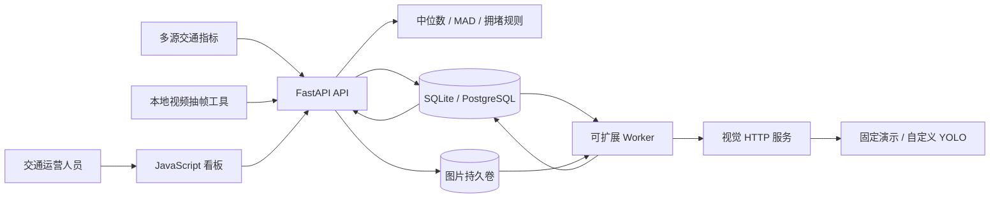
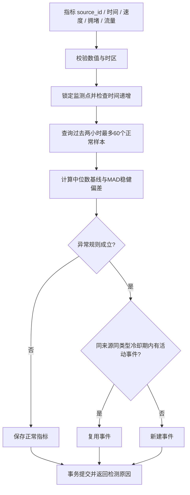
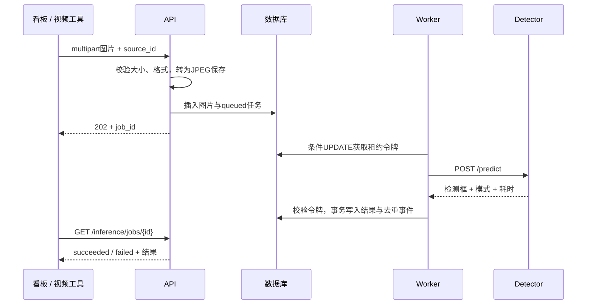
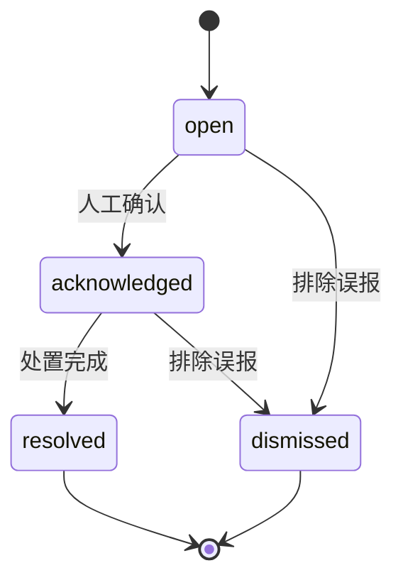
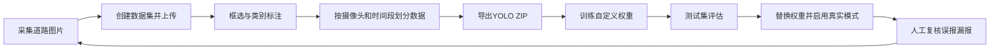

# 架构与流程

系统将接入与交互留在 API，将耗时视觉计算交给独立 Detector，由 Worker 连接数据库任务队列。时序计算为有界历史窗口同步执行。默认三进程共享 SQLite 和图片目录；部署时改为 PostgreSQL 与共享持久卷。

## 服务架构

## 时序检测

## 异步视觉任务

## 事件状态机

跳过确认直接解决、关闭后重新打开、重复执行同一状态都会返回 409。状态条件更新防止并发覆盖，状态与操作记录在同一事务提交。审计记录当前保存时间、目标状态及备注；共享 API Key 不提供个人身份审计。

## 数据集闭环

## 一致性与容量

- 指标写入先锁 Source 行，保证同源顺序性与冷却事件去重；不同监测点可并行。
- Worker 用条件 UPDATE 和唯一租约令牌抢占；崩溃后的任务 180 秒后可被回收，最多领取三次。
- 网络失败、返回内容非法或生产模式收到演示输出，任务立即 failed，不伪造成功结果。
- HTTP 推理超时 60 秒，应使租约时间大于最大端到端处理耗时；当前无租约心跳。
- 多 Worker 能扩展队列消费；单 Detector 用锁串行执行模型。GPU 吞吐扩展需要增加 Detector 实例和路由。
- 上传与数据库不是分布式事务：提交失败会清理新文件，但极端进程崩溃可留下孤立图片，需运维定期核对。
- SQLite 适用于本机演示；PostgreSQL 模式支持行锁。项目没有给出未经实测的高并发或秒级生产 SLA。
